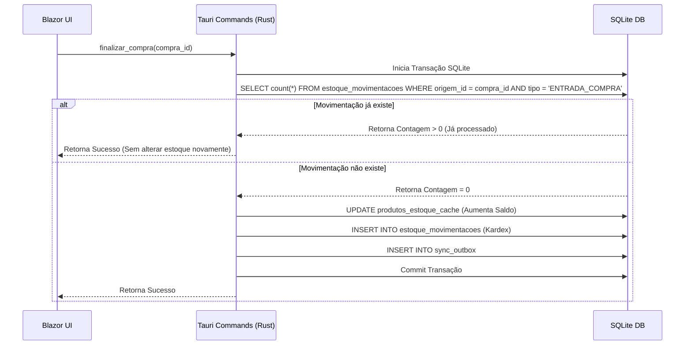

# Idempotência em Compras e Movimentação de Estoque

A integridade do estoque offline e a prevenção contra duplicações de movimentações físicas decorrentes de falhas de rede, retentativas de sincronização (retry) ou cliques duplos na interface de usuário são mantidas no PDV local por meio de mecanismos robustos de idempotência transacional.

## Prevenção de Duplo Clique e Retentativas

Tanto na finalização de uma compra quanto em seu cancelamento (estorno), o Rust/Tauri valida no banco SQLite a presença de movimentações operacionais associadas antes de efetuar qualquer alteração física de saldos.



### Idempotência na Finalização da Compra

Antes de computar as entradas físicas de estoque em `finalizar_compra`, o sistema realiza um teste de existência:

```sql
SELECT 1 FROM estoque_movimentacoes 
WHERE origem_id = ? AND tipo_movimentacao = 'ENTRADA_COMPRA' 
LIMIT 1;
```

- **Se encontrado**: O processamento físico do estoque é ignorado e a transação retorna sucesso imediatamente. Isso garante que retentativas de finalização ou reenvio de comandos não gerem entradas duplicadas para o mesmo produto.
- **Se não encontrado**: O saldo físico é atualizado, a movimentação é gravada no Kardex e os registros de outbox são salvos de forma atômica.

### Idempotência no Cancelamento (Estorno) da Compra

De forma análoga, em `cancelar_compra_finalizada`, o sistema impede estornos redundantes executando a consulta:

```sql
SELECT 1 FROM estoque_movimentacoes 
WHERE origem_id = ? AND tipo_movimentacao = 'ESTORNO_ENTRADA_COMPRA' 
LIMIT 1;
```

- **Se encontrado**: A movimentação de estorno já foi criada no passado; portanto, o cálculo de dedução de saldos e a criação de novas linhas de Kardex são silenciosamente ignorados para evitar duplicidade.
- **Se não encontrado**: O estoque sofre a dedução física e a movimentação `ESTORNO_ENTRADA_COMPRA` com quantidade negativa é registrada.

## Kardex local Insert-Only

Conforme as especificações de auditoria contábil e fiscal do Aureon:

- **Imutabilidade**: A tabela `estoque_movimentacoes` no SQLite é estritamente **Insert-Only**.
- **Sem Updates/Deletes**: Nenhuma instrução do tipo `UPDATE estoque_movimentacoes` ou `DELETE FROM estoque_movimentacoes` é executada para anular uma entrada de nota física. O cancelamento de compra finalizada simplesmente adiciona um novo registro de `ESTORNO_ENTRADA_COMPRA` para balancear a entrada original.
