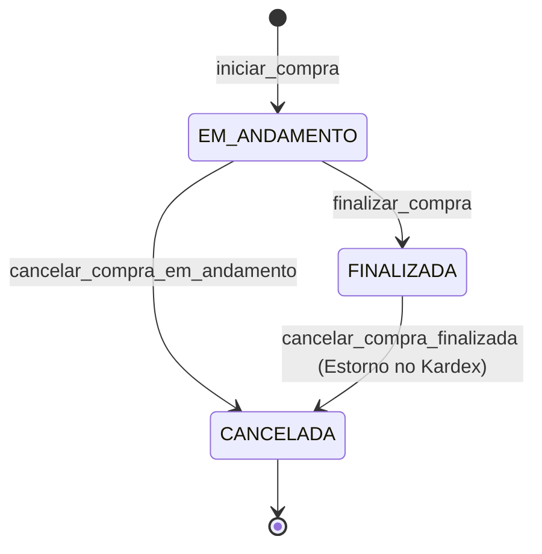

# Compras no PDV Offline-First

O módulo de compras do PDV permite lançar manualmente notas fiscais ou faturas de entrada offline no terminal local, fornecendo autonomia operacional para a reposição de estoque local e atualização de custos de mercadoria.

## Ciclo de Vida da Compra

As compras locais seguem um fluxo rígido de transições de status no banco de dados SQLite:

### Estados da Compra

1. **EM_ANDAMENTO**:
   - É a fase de rascunho da nota. O cabeçalho é criado com o fornecedor, número e moeda.
   - O usuário pode adicionar produtos, remover itens e alterar quantidades.
   - **Estoque & Kardex**: Não sofre nenhuma alteração. Nenhuma movimentação é gerada enquanto a compra estiver neste estado.
   - O cancelamento neste estado é direto (apenas descarta a compra, sem gerar estornos).

2. **FINALIZADA**:
   - A compra torna-se **imutável**. O cabeçalho e itens não podem ser alterados, adicionados ou excluídos.
   - **Estoque & Kardex**: O estoque local é alimentado com as quantidades e uma movimentação `ENTRADA_COMPRA` é gravada de forma atômica.
   - O último custo base do produto é atualizado.
   - Envia o evento `COMPRA_FINALIZADA` no outbox.

3. **CANCELADA**:
   - Representa uma compra cancelada ou descartada. Estado **imutável** e somente leitura.
   - Se originado de uma compra `FINALIZADA`, gera movimentações compensatórias de `ESTORNO_ENTRADA_COMPRA` de sinal inverso no Kardex e deduz os saldos de estoque.
   - Envia o evento `COMPRA_CANCELADA` no outbox.

## Metadados e Cabeçalho da Compra

A tabela de compras armazena informações fiscais e cambiais detalhadas:

- **Fornecedor**: Obrigatório. Selecionado a partir do `fornecedores_cache` (fornecedor ativo). O nome do fornecedor é copiado para `fornecedor_nome_snapshot` na compra para fins históricos.
- **Identificação Fiscal**:
  - `numero_nota`: Opcional (número físico da NF/Fatura).
  - `serie`: Opcional.
  - `chave_acesso_xml_fiscal`: Chave de 44 dígitos (opcional).
  - `data_emissao`: Data de emissão da nota (padrão `yyyy-MM-dd`).
- **Mapeamento Cambial**:
  - `moeda_codigo`: Código da moeda da nota (ex: `BRL`, `USD`, `EUR`).
  - `taxa_cambio_escala6`: Taxa de câmbio snapshot em relação à moeda principal (BRL), gravada na escala de 6 casas decimais. Para BRL, a taxa é sempre `1000000`.

## Itens da Compra e Rastreabilidade

Cada item inserido na compra possui metadados específicos para controle futuro e auditoria:

- **Produto**: Selecionado a partir do cache local `produtos_cache`.
- **Valores e Quantidades**:
  - Quantidade gravada como inteiro na escala 3 (`quantidade_escala3`).
  - Custo unitário gravado em minor units (`custo_unitario_minor`).
  - Total calculado: `total_item_minor = (quantidade * custo) / 1000`.
- **Campos Estruturais de Rastreabilidade**:
  - `lote`: String contendo o lote informado do item.
  - `validade`: String contendo a data de vencimento informada do item.
  - `serial` / `imei`: String de série para equipamentos eletrônicos ou celulares.
  - *Nota: Estes campos são armazenados na tabela de itens da nota de forma documental e não possuem regras de bloqueio operacional no checkout nesta fase.*
