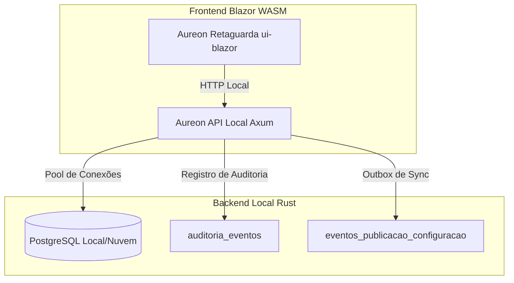

# 🚀 Aureon Sistema Inteligente — Relatório da Fase 2

Este documento descreve os marcos, a arquitetura física de dados, os endpoints da API local e a nova interface de Retaguarda implementada com sucesso na **Fase 2 — Configuração da Empresa, Multimoeda e Fiscal Base**.

---

## 🏛️ 1. Arquitetura Geral da Fase 2

A Fase 2 estabelece a fundação de parametrização operacional e controle fiscal internacional (Brasil/Paraguai) do Aureon, garantindo conformidade operacional para múltiplos perfis de filiais, caixas e vendas offline.

---

## 🟩 2. Estrutura Física de Dados (PostgreSQL)

Foi implementada e executada com sucesso a migration `004_configuracao_empresa.sql` no banco local `couto_bd` do PostgreSQL. As tabelas criadas foram:

*   **`empresas`**: Registro mestre do estabelecimento comercial.
*   **`configuracoes_empresa`**: Configuração de idiomas, status operacional, fuso horário e dados fiscais.
*   **`empresas_documentos`**: CNPJ, CPF, RUC, C.I., I.E., I.M., e RG.
*   **`empresas_contatos`**: Telefones, e-mail, site e responsável.
*   **`empresas_enderecos`**: Logradouro, número, bairro, cidade, CEP, estado e país.
*   **`empresas_logos`**: Caminho físico e uso do logotipo em relatórios e comprovantes do PDV.
*   **`empresas_moedas`**: Configuração das moedas habilitadas (BRL, USD, PYG) e parametrizações multimoeda (troco e pagamentos múltiplos).
*   **`cotacoes_moedas`**: Histórico completo de taxas diretas e inversas diárias.
*   **`configuracoes_fiscais_brasil`**: Regime tributário (CRT), ambiente (Homologação/Produção), emissões habilitadas (NFC-e, NF-e, NFS-e) e provedor fiscal.
*   **`configuracoes_fiscais_paraguai`**: Regime tributário SET, ambiente de testes, emissão Sifen e provedor fiscal.
*   **`parametros_operacionais_empresa`**: Regras operacionais rígidas para controle de estoque negativo, bloqueio de produtos vencidos, políticas de descontos no PDV, segurança com senhas de supervisor, limites de venda a prazo (crediário) e tolerância offline.
*   **`auditoria_eventos`**: Rastreabilidade e logs de alteração contendo dados antes e depois (`valor_anterior`, `valor_novo` em JSONB).
*   **`eventos_publicacao_configuracao`**: Outbox para publicação e sincronização de eventos operacionais e taxas diárias.

---

## 🟨 3. API Local Axum Rust (Rotas Implementadas)

Os seguintes endpoints de alta performance foram desenvolvidos, testados e validados pelo compilador Rust com suporte a precisão financeira (`rust_decimal`), segurança e injeção do pool de conexões PostgreSQL:

| Método | Rota | Descrição |
| :--- | :--- | :--- |
| **GET** | `/empresa/configuracao` | Carrega os dados gerais, contatos, endereços e identificação da empresa. |
| **POST/PUT** | `/empresa/configuracao` | Cria ou atualiza as configurações cadastrais da empresa e gera log de auditoria. |
| **GET** | `/empresa/moedas` | Carrega as moedas operacionais e parâmetros multimoeda. |
| **PUT** | `/empresa/moedas` | Salva a configuração de moedas operacionais e define a Moeda Principal. |
| **GET** | `/empresa/cotacoes` | Lista o histórico diário de taxas e cotações ativas. |
| **POST** | `/empresa/cotacoes` | Insere nova taxa diária calculando automaticamente a taxa inversa. |
| **PUT** | `/empresa/cotacoes/:id/cancelar` | Cancela uma cotação diária de forma manual e segura. |
| **GET** | `/empresa/fiscal` | Carrega os parâmetros fiscais brasileiros e paraguaios. |
| **PUT** | `/empresa/fiscal` | Grava as configurações fiscais por país. |
| **GET** | `/empresa/parametros-operacionais` | Obtém os parâmetros operacionais de estoque, segurança e PDV. |
| **PUT** | `/empresa/parametros-operacionais` | Grava e atualiza as políticas de segurança e estoque. |
| **GET** | `/empresa/auditoria` | Retorna o log de segurança das últimas 100 alterações realizadas. |
| **GET** | `/empresa/status-configuracao` | Retorna o status de inicialização e se o caixa está liberado. |

---

## 🟦 4. Retaguarda/Gestor Blazor WASM

Criamos o projeto frontend independente **`apps/aureon-retaguarda/ui-blazor`** contendo:

1.  **Layout Glassmorphism Premium**: Tema Dark Mode nativo com cores harmoniosas de gradiente azul, blur de vidro e painéis flutuantes.
2.  **Interface Reativa em 13 Abas**: Controle visual que esconde/mostra seções com base no país selecionado.
3.  **Câmbio Automático e Preciso**: A interface calcula reativamente em milissegundos a taxa inversa à medida que o usuário digita a taxa de câmbio direta, garantindo validação visual.
4.  **Painel de Auditoria Integrado**: Listagem dinâmica dos eventos de segurança extraídos do PostgreSQL.

---

## 📄 Documentação Complementar

*   [Decisões de Projeto](file:///e:/01- SISTEMA AUREON/docs/decisions.md)
*   [Configuração da Empresa](file:///e:/01- SISTEMA AUREON/docs/company-configuration.md)
*   [Guia de Multimoeda](file:///e:/01- SISTEMA AUREON/docs/multicurrency.md)
*   [Guia de Fiscal Base](file:///e:/01- SISTEMA AUREON/docs/fiscal-base.md)
